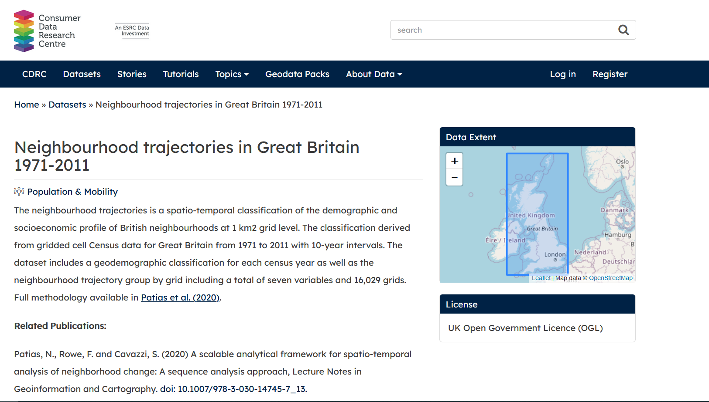

The outputs of the trajectories of neighbourhood socioeconomic change in Great Britain (197-2011) can be downloaded as a geopackage from CDRC website
[here](https://data.cdrc.ac.uk/dataset/neighbourhood-trajectories-great-britain-1971-2011)

