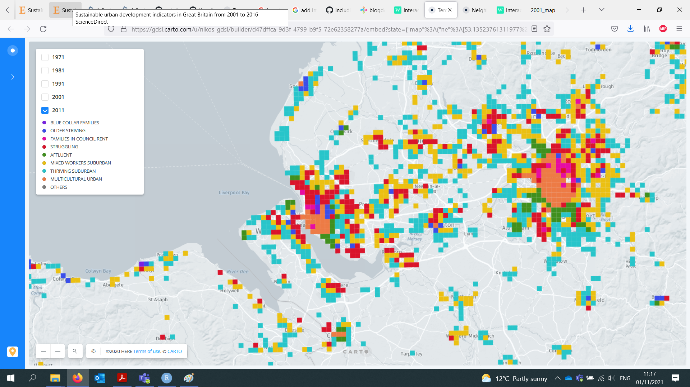
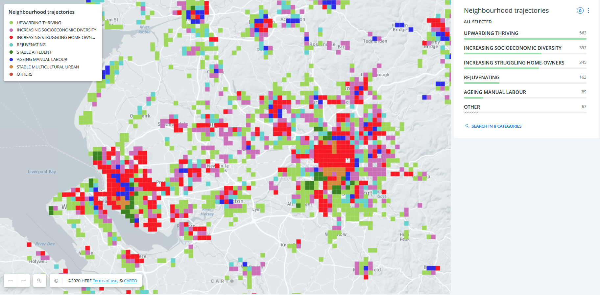
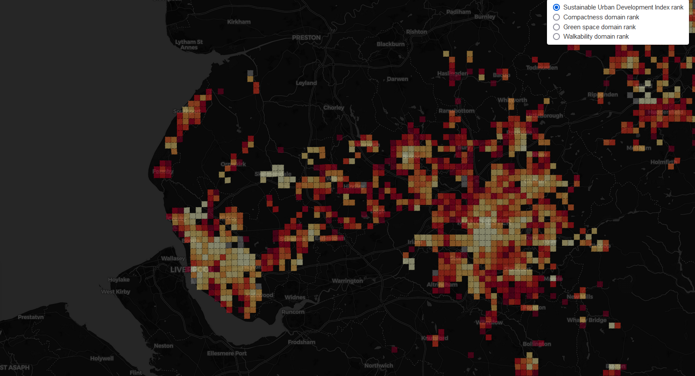

* Temporal neighbourhood classification 1971-2011
[Access here](https://gdsl.carto.com/u/nikos-gdsl/builder/d47dffca-9d3f-4799-b9f5-72e62358277a/embed)

* Neighbourhood trajectories 1971-2011
[Access here](https://gdsl.carto.com/u/nikos-gdsl/builder/6ffa532d-ee60-473c-8dbd-3896e482fe4c/embed)

* Sustainable Urban Development Index (SUDI)
[Access here](https://patnik.github.io/sustainable-urban-development-index/)

